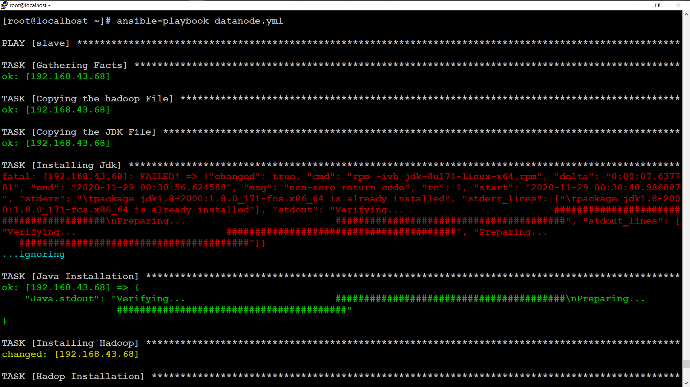
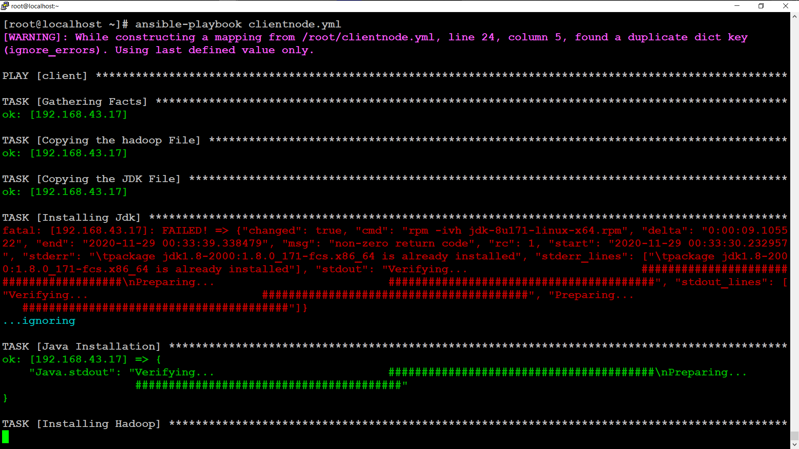
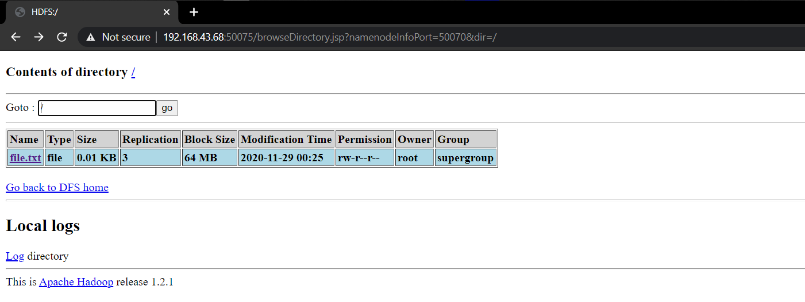

# Automating-Hadoop-Using-Ansible-
Configure Hadoop cluster using Ansible automation.

## What is hadoop ?

The Hadoop Distributed File System (HDFS) is a distributed file system designed to run on commodity hardware. It has many similarities with existing distributed file systems. However, the differences from other distributed file systems are significant. HDFS is highly fault-tolerant and is designed to be deployed on low-cost hardware. HDFS provides high throughput access to application data and is suitable for applications that have large data sets. HDFS relaxes a few POSIX requirements to enable streaming access to file system data. HDFS was originally built as infrastructure for the Apache Nutch web search engine project. HDFS is now an Apache Hadoop subproject

Apache Hadoop is a collection of open-source software utilities that facilitates using a network of many computers to solve problems involving massive amounts of data and computation. It provides a software framework for distributed storage and processing of big data using the MapReduce programming model.


## What is Hadoop Cluster ?

A Hadoop cluster is a collection of computers, known as nodes, that are networked together to perform these kinds of parallel computations on big data sets.

## What is Namenode ?

The NameNode is the centerpiece of an HDFS file system. It keeps the directory tree of all files in the file system, and tracks where across the cluster the file data is kept. It does not store the data of these files itself. ... The NameNode is a Single Point of Failure for the HDFS Cluster

## What is Datanode ?

A DataNode stores data in the [HadoopFileSystem]. A functional filesystem has more than one DataNode, with data replicated across them. ... It then responds to requests from the NameNode for filesystem operations. Client applications can talk directly to a DataNode, once the NameNode has provided the location of the data.

## What is Client Node ?

Client nodes are in charge of loading the data into the cluster. Client nodes first submit MapReduce jobs describing how data needs to be processed, and then fetch the results once the processing is finished.

## What is Ansible ?

Ansible is a software tool that provides simple but powerful automation for cross-platform computer support. It is primarily intended for IT professionals, who use it for application deployment, updates on workstations and servers, cloud provisioning, configuration management, intra-service orchestration, and nearly anything a systems administrator does on a weekly or daily basis. Ansible doesn't depend on agent software and has no additional security infrastructure, so it's easy to deploy.

## Modules in Ansible
Modules (also referred to as “task plugins” or “library plugins”) are discrete units of code that can be used from the command line or in a playbook task. Ansible executes each module, usually on the remote managed node, and collects return values

Here in this article you will find the complete end to end automation of hadoop hdfs cluster using ansible.

So, you need to write the playbooks of respective configuration on the target node. we need to first configure the namenode and start it. The playbook of namenode is written below.

## Variables in Ansible:
Ansible uses variables to manage differences between systems. With Ansible, you can execute tasks and playbooks on multiple different systems with a single command. ... You can define these variables in your playbooks, in your inventory, in re-usable files or roles, or at the command line.

## Name Node Variables:

```bash 

namenode variables 👇👇

hadoop_path: "/root/hadoop-1.2.1-1.x86_64.rpm"
jdk_path: "/root/jdk-8u171-linux-x64.rpm"
hadoop_software: "hadoop-1.2.1-1.x86_64.rpm"
jdk_software: "jdk-8u171-linux-x64.rpm"
core_site: "/root/namenode_files/core-site.xml"
hdfs_site: "/root/namenode_files/hdfs-site.xml"
directory_path: "/nn"
start_namenode: "hadoop-daemon.sh start namenode"
run_jps: "jps"
directory_delete: "rm -rf /nn"
stop_namenode: "hadoop-daemon.sh stop namenode"
hadoop_report: "hadoop dfsadmin -report"
```

### Now the playbook of the namenode is given below with respect variable.

NameNode Playbook:
``` yml
- hosts: namenode
  vars_files:
     - namenode_var.yml
  tasks:
  - name: "Copying the hadoop File"
    copy:
     src: "{{ hadoop_path }}"
     dest: "/root/"
  - name: "Copying the JDK File"
    copy:
     src: "{{ hadoop_software }}"
     dest: "/root/"
  - name: "Installing Jdk"
    shell: "rpm -ivh {{ jdk_software }}"
    register: Java
    ignore_errors: yes
  - name: "Java Installation"
    debug:
      var: Java.stdout
  - name: "Installing Hadoop"
    shell: "rpm -ivh {{ hadoop_software }}  --force"
    register: Hadoop
    ignore_errors: yes
  - name: "Hadop Installation"
    debug:
      var: Hadoop.stdout
  - name: "Copying the core-site.xml file"
    copy:
      src: "{{ core_site }}"
      dest: "/etc/hadoop/"
  - name: "Copying the hdfs-site.xml file"
    copy:
      src: "{{ hdfs_site }}"
      dest: "/etc/hadoop/"
  - name: "Deleting the directory"
    shell: "directory_delete"
    ignore_errors: yes
  - name: "Creating a directory"
    file:
      state: directory
      path: "{{ directory_path }}"
  - name: "Formatting the directory"
    shell: "echo Y |  hadoop namenode -format"
    register: format
  - name: "Formating NameNode"
    debug:
      var: format.stdout
  - name: "Stoping the namenode"
    shell: "{{ stop_namenode }}"
    ignore_errors: yes
    register: hadoop_stopped
  - name: "Stopping hadoop"
    debug:
     var: hadoop_stopped.stdout


  - name: "Starting the namenode"
    shell: "{{ start_namenode }}"
    ignore_errors: yes
    register: hadoop_started
  - name: "Started hadoop"
    debug:
     var: hadoop_started.stdout
  - name: "Java Process"
    shell: "{{ run_jps }}"
    register: jps
  - name: "Java Process"
    debug:
     var: jps.stdout
```
the command to run the namenode playbook is given below.

 ```bash 
 ansible-playbook   namenode.yml 
 ```
 
#### Running Namenode Playbook


## DataNode Variables:

```bash
datanode variables 👇👇

hadoop_path: "/root/hadoop-1.2.1-1.x86_64.rpm"
jdk_path: "/root/jdk-8u171-linux-x64.rpm"
hadoop_software: "hadoop-1.2.1-1.x86_64.rpm"
jdk_software: "jdk-8u171-linux-x64.rpm"
core_site: "/root/datanode_files/core-site.xml"
hdfs_site: "/root/datanode_files/hdfs-site.xml"
directory_path: "/dn1"
start_datanode: "hadoop-daemon.sh start datanode"
run_jps: "jps"
directory_delete: "rm -rf /dn1"
stop_datanode: "hadoop-daemon.sh stop datanode"
hadoop_report: "hadoop dfsadmin -report"
```

### Now the playbook of the datanode is given below with respect variable.

```yml
Datanode Playbook:
- hosts: datanode
  vars_files:
     - datanode_var.yml
  tasks:
  - name: "Copying the hadoop File"
    copy:
     src: "{{ hadoop_path }}"
     dest: "/root/"
  - name: "Copying the JDK File"
    copy:
     src: "{{ hadoop_software }}"
     dest: "/root/"
  - name: "Installing Jdk"
    shell: "rpm -ivh {{ jdk_software }}"
    register: Java
    ignore_errors: yes
  - name: "Java Installation"
    debug:
      var: Java.stdout
  - name: "Installing Hadoop"
    shell: "rpm -ivh {{ hadoop_software }}  --force"
    register: Hadoop
    ignore_errors: yes
  - name: "Hadop Installation"
    debug:
      var: Hadoop.stdout
  - name: "Copying the core-site.xml file"
    copy:
      src: "{{ core_site }}"
      dest: "/etc/hadoop/"
  - name: "Copying the hdfs-site.xml file"
    copy:
      src: "{{ hdfs_site }}"
      dest: "/etc/hadoop/"
  - name: "Deleting the directory"
    shell: "{{ directory_delete }}"
    ignore_errors: yes
  - name: "Creating a directory"
    file:
      state: directory
      path: "{{ directory_path }}"
  - name: "Formatting the directory"
    shell: "echo Y |  hadoop namenode -format"
    ignore_errors: yes
    register: format
  - name: "Formating NameNode"
    debug:
      var: format.stdout
  - name: "Stoping the namenode"
    shell: "{{ stop_datanode }}"
    ignore_errors: yes
    register: hadoop_stopped
  - name: "Stopping hadoop"
    debug:
     var: hadoop_stopped.stdout


  - name: "Starting the namenode"
    shell: "{{ start_datanode }}"
    ignore_errors: yes
    register: hadoop_started
  - name: "Started hadoop"
    debug:
     var: hadoop_started.stdout
  - name: "Java Process"
    shell: "{{ run_jps }}"
    register: jps
  - name: "Java Process"
    debug:
     var: jps.stdout
  - name: "Running Hadoop Report"
    shell: "{{ hadoop_report }}"
    register: hadoop_report
  - name: "Shoowing Hadoop Report"
    debug:
     var: hadoop_report.stdout

```
the command to run the Datanode playbook is given below.
```bash
 ansible-playbook   datanode.yml 
```

### Running Datanode Playbook



## ClientNode Variables:

```bash
clientnode variables 👇👇

hadoop_path: "/root/hadoop-1.2.1-1.x86_64.rpm"
jdk_path: "/root/jdk-8u171-linux-x64.rpm"
hadoop_software: "hadoop-1.2.1-1.x86_64.rpm"
jdk_software: "jdk-8u171-linux-x64.rpm"
core_site: "/root/client_files/core-site.xml"
hadoop_report: "hadoop dfsadmin -report"
client_report: "hadoop fs -ls  /"
file_name: "file.txt"
put_file: "hadoop fs -put  /root/{{ file_name }}   / "
client_file_src: "/root/client_files/{{ file_name }}"
remove_file: "hadoop fs -rm /{{ file_name }}"
client_file_dest: "/root/"
```

Now the playbook of the clientnode is given below with respect variable.

### ClientNode Playbook:
```yml
- hosts: client
  vars_files:
     - client_var.yml
  tasks:
  - name: "Copying the hadoop File"
    copy:
     src: "{{ hadoop_software }}"
     dest: "/root/"
  - name: "Copying the JDK File"
    copy:
     src: "{{ jdk_path }}"
     dest: "/root/"
  - name: "Installing Jdk"
    shell: "rpm -ivh {{ jdk_software }}"
    ignore_errors: yes
    register: Java
    ignore_errors: yes
  - name: "Java Installation"
    debug:
      var: Java.stdout
  - name: "Installing Hadoop"
    shell: "rpm -ivh {{ hadoop_software }}  --force"
    register: Hadoop
    ignore_errors: yes
  - name: "Hadop Installation"
    debug:
      var: Hadoop.stdout
  - name: "Copying the core-site.xml file"
    copy:
      src: "{{ core_site }}"
      dest: "/etc/hadoop/"
  - name: "Files Avalable"
    shell: "{{ client_report }}"
    register: files
  - name: "Showing Files"
    debug:
     var: files
  - name: "Deleting Previous Files"
    shell: "{{ remove_file }}"
    ignore_errors: yes
  - name: "Copying the files to client node"
    copy:
      src: "{{ client_file_src }}"
      dest: "{{ client_file_dest }}"
  - name: "Uploading the Files by client"
    shell: "{{ put_file }}"
  - name: "Files Avalable"
    shell: "{{ client_report }}"
    register: files
  - name: "Showing Files"
    debug:
     var: files
  - name: "Running Hadoop Report"
    shell: "{{ hadoop_report }}"
    register: hadoop_report
  - name: "Shoowing Hadoop Report"
    debug:
     var: hadoop_report.stdout
```
the command to run the Clientnode playbook is given below.
```bash
 ansible-playbook   clientnode.yml 
 ```
### Running Clinetnode Playbook


As the Client Node ran successfully, now we need to see the dashboard that file that client wanted to send is sended successfully or not.


